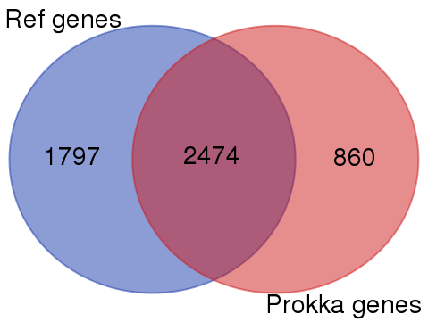

# Test pipeline 

## 1. Assemblage 

* Utilisation de SPAdes (v3.11.1), paramètres par défaut 

* Données utilisées : ERR1073432 (séquençage paired-end Illumina HiSeq 2000 d'Escherichia coli K12 substr. MG1655) https://www.ebi.ac.uk/ena/data/view/ERR1073432

* Résultats : 175 contigs, 166 scaffolds 

## 2. Annotation 

* Utilisation de PROKKA (v1.12), paramètres par défaut

Prédiction faites par PROKKA (pour ce test) :  
- tRNA et tmRNA en utilisant Aragorn  
- rRNA avec Barrnap
- Recherche de répétitions CRISPR  
- Séquences codantes : prédictions de CDS avec Prodigal et alignement des CDS avec blastp contre les bases de données de références fournies par Prokka.  

**Comparaison rapide annotation** 

1. Comparaison des gènes prédits 

* Idée : comparer le nom des gènes annotés sur la référence avec le nom donné au CDS par Prokka qui correspond au nom du gène trouvé dans la base de données.  

 * Mise en oeuvre : script split_gff.py qui permet de récupérer le champ nom dans un fichier. On obtient un fichier pour la référence et un fichier pour l'annotation Prokka. Le résultat peut être visualisé par un diagramme de Venn (utilisation d'un outil en ligne : http://bioinformatics.psb.ugent.be/webtools/Venn/)

 * Résultat : 

 * **Remarque** : cette première approche est très sommaire et peu rigoureuse. Il faudrait faire des vérifications sur autre chose que les noms, et notamment regarder si les séquences correspondent vraiment. 

